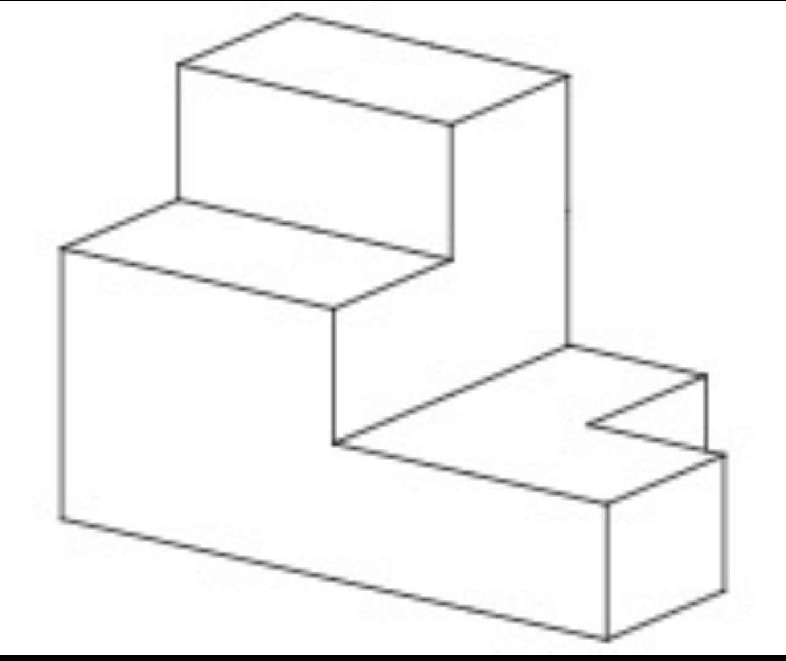
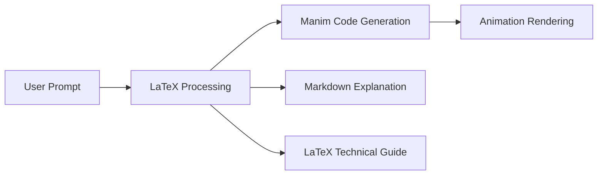

# Important Note


This repository contains the **output files** of a mathematical animation generation process, not the complete pipeline. Users can run these files to render the animations on their machines, but the model and methodology used to generate these animation scripts are not included. 

In other words, this repo provides the Manim code that produces the visualizations, but not the AI system that creates this code from mathematical concepts. The complete pipeline from mathematical concept to animation code remains proprietary.

[March 3rd]: I will soon publish an [@smolagents](https://github.com/huggingface/smolagents) that is trained on taking basic prompts and turning them into the prompts the LLM needs. You need about a 2000 token prompt to get fully working manim code out. The agent will make that for you. Rendering will still happen on your machine. The output is the python, depending on the scene, render time could be 5 minutes to 4 hours. There are a wide number of examples already in the repo. The /Doc folder is the Latex output from the model rendered into a PDF. An agent seems like what would help most people so i'll publish that soon. 

Your prompts need extreme detail in order for this to work. For example, this below is a BASIC prompt. You MUST have this level of detail. Most people can't write half of this so the project uses training to try and improve what someone might write as a basic prompt into a what the LLMs are actually looking for. Anyone can do this on your own, I promise this is all prompting but the secret NOT prompting in english - you have to prompt in Latex. Happy hunting!

```latex
"Begin by slowly fading in a panoramic star field backdrop to set a cosmic stage. As the camera orients itself to reveal a three-dimensional axis frame, introduce a large title reading 'Quantum Field Theory: 
A Journey into the Electromagnetic Interaction,' written in bold, glowing text at the center of the screen. The title shrinks and moves into the upper-left corner, making room for a rotating wireframe representation of 4D Minkowski spacetime—though rendered in 3D for clarity—complete with a light cone that stretches outward. While this wireframe slowly rotates, bring in color-coded equations of the relativistic metric, such as 
ds2=−c2dt2+dx2+dy2+dz2ds^2 = -c^2 dt^2 + dx^2 + dy^2 + dz^2, with each component highlighted in a different hue to emphasize the negative time component and positive spatial components.

Next, zoom the camera into the wireframe's origin to introduce the basic concept of a quantum field. Show a ghostly overlay of undulating plane waves in red and blue, symbolizing an electric field and a magnetic field respectively, oscillating perpendicularly in sync. Label these fields as E⃗\vec{E} and B⃗\vec{B}, placing them on perpendicular axes with small rotating arrows that illustrate their directions over time. Simultaneously, use a dynamic 3D arrow to demonstrate that the wave propagates along the z-axis. 

As the wave advances, display a short excerpt of Maxwell's equations, morphing from their classical form in vector calculus notation to their elegant, relativistic compact form: ∂μFμν=μ0Jν\partial_\mu F^{\mu \nu} = \mu_0 J^\nu. Animate each transformation by dissolving and reassembling the symbols, underscoring the transition from standard form to four-vector notation.

Then, shift the focus to the Lagrangian density for quantum electrodynamics (QED):
LQED=ψˉ(iγμDμ−m)ψ−14FμνFμν.\mathcal{L}_{\text{QED}} = \bar{\psi}(i \gamma^\mu D_\mu - m)\psi - \tfrac{1}{4}F_{\mu\nu}F^{\mu\nu}.

Project this equation onto a semi-transparent plane hovering in front of the wireframe spacetime, with each symbol color-coded: the Dirac spinor ψ\psi in orange, the covariant derivative DμD_\mu in green, the gamma matrices γμ\gamma^\mu in bright teal, and the field strength tensor FμνF_{\mu\nu} in gold. Let these terms gently pulse to indicate they are dynamic fields in spacetime, not just static quantities. 

While the Lagrangian is on screen, illustrate the gauge invariance by showing a quick animation where ψ\psi acquires a phase factor eiα(x)e^{i \alpha(x)}, while the gauge field transforms accordingly. Arrows and short textual callouts appear around the equation to explain how gauge invariance enforces charge conservation.
Next, pan the camera over to a large black background to present a simplified Feynman diagram. Show two electron lines approaching from the left and right, exchanging a wavy photon line in the center. 

The electron lines are labeled e−e^- in bright blue, and the photon line is labeled γ\gamma in yellow. Subtitles and small pop-up text boxes narrate how this basic vertex encapsulates the electromagnetic interaction between charged fermions, highlighting that the photon is the force carrier. Then, animate the coupling constant α≈1137\alpha \approx \frac{1}{137} flashing above the diagram, gradually evolving from a numeric approximation to the symbolic form α=e24πϵ0ℏc\alpha = \frac{e^2}{4 \pi \epsilon_0 \hbar c}.

Afterward, transition to a 2D graph that plots the running of the coupling constant α\alpha with respect to energy scale, using the renormalization group flow. As the graph materializes, a vertical axis labeled 'Coupling Strength' and a horizontal axis labeled 'Energy Scale' come into view, each sporting major tick marks and numerical values. The curve gently slopes upward, illustrating how α\alpha grows at higher energies, with dynamic markers along the curve to indicate different experimental data points. Meanwhile, short textual captions in the corners clarify that this phenomenon arises from virtual particle-antiparticle pairs contributing to vacuum polarization.

In the final sequence, zoom back out to reveal a cohesive collage of all elements: the rotating spacetime grid, the undulating electromagnetic fields, the QED Lagrangian, and the Feynman diagram floating in the foreground. Fade in an overarching summary text reading 'QED: Unifying Light and Matter Through Gauge Theory,' emphasized by a halo effect. The camera then slowly pulls away, letting the cosmic background re-emerge until each component gracefully dissolves, ending on a single star field reminiscent of the opening shot. A concluding subtitle, 'Finis,' appears, marking the animation's closure and prompting reflection on how fundamental quantum field theory is in describing our universe." 
```

---

# Math-To-Manim 

## Star History

[](https://star-history.com/#HarleyCoops/Math-To-Manim&Date)

## Project Overview 

This project uses DeepSeek AI (and some Google Gemini (and now #Grok3) to generate mathematical animations using Manim with better prompts. It includes various examples of complex mathematical concepts visualized through animation. The intent here is to attempt to automatically chart concepts that far exceed most humans' capacity to visualize complex connections across math and physics in a one-shot animation. The future intent is to use RL to fine tune a model on all the working verbose prompts to arrive at 100% one-shot animations from only text descriptions.

**Technical Insight**:
- **LaTeX Matters**: Base prompt engineering technique yielding much better results for displaying formulas on screen.
- **Dual-Stream Output**: Simultaneous animation code + study notes generation. No model fine tuning necessary. Just pass any working python scene script back as a prompt and ask for "verbose explanations fully rendered as latext study notes.." and you will get working latex that renders into a PDF set at Overleaf.

**Key Features & Innovations**:
- **Cross-Model Synergy**: Leveraging multiple AI models (DeepSeek, Gemini, Grok3) allows for unique perspectives on mathematical visualization, often catching edge cases a single model might miss.
- **Educational Impact**: The generated animations serve as powerful teaching tools, breaking down complex mathematical concepts into visually digestible sequences.
- **Automated Documentation**: The system not only generates animations but also produces comprehensive LaTeX documentation, creating a complete learning package.
- **Adaptive Complexity**: Can handle everything from basic geometric proofs to advanced topics like quantum mechanics and optimal transport theory.
- **Interactive Development**: The project includes a feedback loop where successful animations can be used to improve prompt engineering for future generations.

**Real-World Applications**:
- **Academic Research**: Visualizing complex mathematical proofs and theories
- **Education**: Creating engaging materials for STEM courses
- **Scientific Communication**: Bridging the gap between abstract mathematics and visual understanding
- **Research Validation**: Providing visual verification of mathematical concepts and relationships

The model is *not yet* a fully fine-tuned version of [DeepSeek's R1 Zero](https://huggingface.co/deepseek-ai/DeepSeek-R1-Zero), but I am working on that (Still working on this, better prompting still works best). Most errors you will encounter when attempting animations on your own in one shot will be related to how LaTeX is being interpreted as a formula to be rendered on the screen or as part of the code itself. 

An interesting new thing to ask for is the capacity to generate simultaneous "study notes" that accompany each animation with a complete explanation of the math and context of the animation. The Benamou animation and notes were the first attempt at this. This also just works straight from the prompt if you pass the scene code directly back to the model.


## Quick Start

1. **Clone & Setup**
   ```bash
   git clone https://github.com/HarleyCoops/Math-To-Manim
   cd Math-To-Manim
   ```

2. **Environment Setup**
   ```bash
   # Create and configure .env file with your API key
   echo "DEEPSEEK_API_KEY=your_key_here" > .env
   
   # Install dependencies
   pip install -r requirements.txt
   ```

3. **Install FFmpeg**
   - **Windows**: 
     - Download from https://www.gyan.dev/ffmpeg/builds/
     - Add to PATH or use: `choco install ffmpeg`
   - **Linux**: `sudo apt-get install ffmpeg`
   - **macOS**: `brew install ffmpeg`

4. **Launch Interface**
   ```bash
   python app.py
   ```

**Performance Tip**: For faster installs, use `pip install -r requirements.txt --no-cache-dir`

---

## Directory Structure

```
.
├── app.py                           # Main application interface
├── text_to_manim.py                # Core animation generation logic
├── requirements.txt                 # Project dependencies
├── .env                            # Environment configuration
│
├── Animations/
│   ├── CosmicProbabilityScene.py   # Cosmic probability visualization
│   ├── ElectroweakSymmetryScene.py # Electroweak symmetry animation
│   ├── QED.py                      # Quantum Electrodynamics scenes
│   ├── diffusion_ot.py            # Diffusion Optimal Transport
│   └── pythagorean.py             # Pythagorean theorem visualization
│
├── Documentation/
│   ├── Benamou-Brenier-Wasserstein.md   # BBW concept explanation
│   ├── Benamou-Brenier-Wasserstein.tex  # LaTeX documentation
│   ├── GoogleBBW.md                     # Google's BBW implementation
│   └── ElectroweakMeaning.md           # Electroweak theory explanation
│
└── media/                          # Generated animation outputs
```

**Key Implementation Details**:
- **LaTeX→Manim Bridge**: Regex-based sanitization of mathematical expressions
- **Animation Validation**: Automated scene graph analysis pre-render
- **Documentation Engine**: Markdown/LaTeX dual-output system

---

## Available Animations

### 1. Benamou-Brenier-Wasserstein (BBW)
- **Source**: `CosmicProbabilityScene.py`
- **Documentation**: `Benamou-Brenier-Wasserstein.md`
- **Render Command**:
  ```bash
  python -m manim -qh CosmicProbabilityScene.py CosmicProbabilityScene
  ```

### 2. Electroweak Symmetry
- **Source**: `ElectroweakSymmetryScene.py`
- **Documentation**: `ElectroweakMeaning.md`
- **Render Command**:
  ```bash
  python -m manim -qh ElectroweakSymmetryScene.py ElectroweakSymmetryScene
  ```

### 3. Quantum Electrodynamics (QED)
- **Source**: `QED.py`, `Verbose_QED.py`
- **Render Command**:
  ```bash
  python -m manim -qh QED.py QEDScene
  ```

### 4. Gale-Shapley Algorithm
- **Source**: `gale-shaply.py`
- **Documentation**: See `/docs` for detailed formula explanations
- **Description**: Visualizes the Gale-Shapley algorithm for stable matching, showing bipartite graphs, preference orderings, and stability conditions.
- **Render Command**:
  ```bash
  python -m manim -qh gale-shaply.py GaleShapleyVisualization
  ```

### 5. Information Geometry
- **Source**: `information_geometry.py`
- **Description**: Explores the landscape of probability through information geometry, visualizing concepts like probability manifolds, KL divergence, and Fisher information.
- **Render Command**:
  ```bash
  python -m manim -qh information_geometry.py InformationGeometryScene
  ```

### 6. Probabilistic Contrastive Loss (ProLIP)
- **Source**: `prolip.py`
- **Description**: Visualizes the ProLIP framework for multimodal learning, showing visual and textual encoders, contrastive loss, and inclusion loss.
- **Render Command**:
  ```bash
  python -m manim -qh prolip.py ProLIPScene
  ```

### 7. Diffusion Models and Optimal Transport
- **Source**: `diffusion_optimal_transport.py`
- **Description**: Illustrates the connection between diffusion models and optimal transport, visualizing the Benamou-Brenier Theorem and Wasserstein Distance.
- **Render Command**:
  ```bash
  python -m manim -qh diffusion_optimal_transport.py DiffusionAndOptimalTransport
  ```

### 8. Radium Atom Structure
- **Source**: `radium_atom.py`
- **Description**: Visualizes the Bohr-Sommerfeld model of the radium atom, showing orbital structures, quantization rules, and energy levels.
- **Render Command**:
  ```bash
  python -m manim -qh radium_atom.py RadiumAtomStructure
  ```

### 9. Quantum Field Theory Journey
- **Source**: `grok_quantum2.py`
- **Description**: Takes viewers on a journey through Quantum Electrodynamics (QED), visualizing concepts like spacetime, light cones, electromagnetic waves, and Feynman diagrams.
- **Render Command**:
  ```bash
  python -m manim -qh grok_quantum2.py QEDJourney
  ```

### 10. Nested Geometric Shapes
- **Source**: `stickman.py`
- **Description**: Creates a 3D animation showing nested geometric shapes (human inside house inside sphere inside cube inside cylinder inside pyramid).
- **Render Command**:
  ```bash
  python -m manim -qh stickman.py InscribedShapes
  ```

**Note**: The current implementation focuses on mathematical formulas and visualizations. Future improvements will enhance the explanatory text display for better readability and understanding of the concepts. One-shot explanatory formulas and detailed documentation can be found in the `/docs` directory.

### 11. Rhombicosidodecahedron Animations
- **Source**: Located in `Rhombicosidodecahedron/` directory
- **Animations**:
  1. `bouncing.py` - Complex 3D bouncing transformations
  2. `flythroughbouncing.py` - Flythrough camera perspective of the bouncing animation
- **Render Commands**:
  ```bash
  # For bouncing animation
  python -m manim -qh Rhombicosidodecahedron/bouncing.py RhombicosidodecahedronScene
  
  # For flythrough perspective
  python -m manim -qh Rhombicosidodecahedron/flythroughbouncing.py FlythroughScene
  ```
- **Note**: These are not one-shot files but rather complex renderings in R1 inspired by [this tweet](https://x.com/_akhaliq/status/1882985442691437006), showcasing sophisticated 3D geometric visualizations

---

## Rendering Options

### Quality Settings
- `-ql` : 480p (development)
- `-qm` : 720p (medium quality)
- `-qh` : 1080p (high quality)
- `-qk` : 4K (ultra high quality)

### Additional Flags
- `-p` : Preview animation
- `-f` : Show output file
- `--format gif` : Export as GIF

### Output Location
Rendered animations are saved in:
```
media/videos/[SceneName]/[quality]/[SceneName].[format]
```

**Pro Tip**: Use `manim cfg write -l` to customize output directories

---

## Development Tips

1. Use `-pql` for rapid development:
   ```bash
   python -m manim -pql YourScene.py YourSceneName
   ```

2. For final renders use `-qh`:
   ```bash
   python -m manim -qh YourScene.py YourSceneName
   ```

**Debugging Aid**: Set `LOG_LEVEL=DEBUG` in .env for detailed generation logs

## Spatial Reasoning Test

The resurgence of prompting sophistication has become evident in my latest experiments. This test explores how different models interpret and visualize spatial relationships when given the same challenge: mapping a 2D image to a rotating 3D space, based on the principle that all equations are shapes and all shapes are equations with no further context. Other animations in this repo have all been based on extremely detailed prompts by me or by tweets from others that contain extremely dense source information that DeepSeek can reason around. 

Both DeepSeek and OpenAI Pro were tasked with this challenge, and their approaches reveal interesting insights into their reasoning processes:

**DeepSeek's Approach:**


**OpenAI Pro's Approach:**


While both models produced interesting but technically incorrect interpretations, the key finding isn't in their accuracy but in their approach. DeepSeek took a methodical, layer-by-layer construction approach, while OpenAI Pro attempted to reason through the spatial relationships in a similar systematic manner.

This experiment is part of a broader investigation into solving mathematics and spatial reasoning problems from the [Humanity's Last Exam (HLE)](https://github.com/centerforaisafety/hle) repository. The key insight gained is that prompting sophistication has become paramount again - when provided with detailed contextual information, DeepSeek in particular shows remarkable improvements in its visualization capabilities.

**Source Image:**


---

## Documentation

Each animation comes with corresponding documentation:
- `.md` files contain concept explanations
- `.tex` files provide mathematical details
- Generated PDFs offer visual guides

### Available Documentation
- [View QED Documentation (PDF)](https://github.com/HarleyCoops/Math-To-Manim/blob/main/docs/QwenQED.pdf)
- [Download QED Documentation (PDF)](https://github.com/HarleyCoops/Math-To-Manim/raw/main/docs/QwenQED.pdf)
- [Benamou-Brenier-Wasserstein.pdf](Benamou-Brenier-Wasserstein.pdf)

**Example Documentation Pipeline**:


---

## Citation

```bibtex
@misc{cooper2025deepseekmanim,
    title={DeepSeek-Manim Animation Generator: Automated Mathematical Animations using DeepSeek API},
    author={Cooper, Christian H.},
    year={2025},
    howpublished={\url{https://github.com/HarleyCoops/Deepseek-R1-Zero}},
    note={A tool for generating Manim animations using DeepSeek's API}
}
```

**Alternative Formats**:
- APA: [Available in Documentation/CITATION.md]
- IEEE: [See rendered PDFs]

---

## Benamou-Brenier-Wasserstein Animation Scene Guide

**Inspiration**: Developed from [Gabriel Peyré's tweet](https://x.com/gabreyre/status/1881220110096236731) demonstrating optimal transport concepts.

**Collaboration**: Scene design was jointly reasoned through by #DeepSeek and #Google AI systems.

### PDF Scene Guide
```latex
% Generate with:
% pdflatex Benamou-Brenier-Wasserstein.tex
\documentclass{article}
\usepackage{tikz}
\begin{document}
\begin{figure}[h]
  \centering
  \begin{tikzpicture}
    % TikZ code for animation frames
    \node at (0,0) {Frame 1: Initial Density};
    \node at (4,0) {Frame 2: Intermediate Flow};
    \node at (8,0) {Frame 3: Final Transport};
  \end{tikzpicture}
  \caption{Wasserstein geodesics visualization sequence}
\end{figure}
\end{document}
```

**Animation Mathematics**:
```python
# Core BBW equation implementation
def benamou_brenier_energy(ρ0, ρ1):
    return ∫∫|∇φ|² dρ0 dx + ∫∫|∇ψ|² dρ1 dx
```

---

## Local APP Features

### Real-time Reasoning Display
The chat interface now shows the AI's reasoning process in real-time! As you interact with the model, you'll see:
- A gray box above each response showing the model's chain of thought
- The final response below the reasoning
- Both updating in real-time as the model thinks

This feature helps you understand how the AI arrives at its conclusions. The reasoning window shows the intermediate steps and thought process before the final answer is given.

**Architecture Insight**:
```python
# Reasoning display implementation
def show_reasoning(thought_process):
    display(f"""
    <div style='background: #f0f0f0; padding: 10px;'>
        {thought_process}
    </div>
    """)
```

---

## Running the Benamou-Brenier-Wasserstein Animation

### 1. Generate the Scene Guide PDF
First, compile the LaTeX scene guide:
```bash
# Navigate to the project directory
cd Math-To-Manim

# Compile the LaTeX file
pdflatex Benamou-Brenier-Wasserstein.tex
```
This will generate `Benamou-Brenier-Wasserstein.pdf`, which contains the visual guide for the animation sequence.

### Pre-rendered Scene Guide
For convenience, I've included a pre-rendered version of the scene guide: [Benamou-Brenier-Wasserstein.pdf](Benamou-Brenier-Wasserstein.pdf)

This comprehensive guide includes:
- Detailed explanations of each animation scene
- Mathematical concepts broken down into intuitive metaphors
- Visual descriptions of the cosmic probability distributions
- Step-by-step breakdowns of the optimal transport equations
- Inspiration credit to [Gabriel Peyré's tweet](https://x.com/gabrielpeyre/status/1881220110096236731)

### 2. Run the Manim Animation
After reviewing the scene guide, you can render the animation using Manim:

```bash
# For development/preview (480p with preview)
python -m manim -pql CosmicProbabilityScene.py CosmicProbabilityScene

# For final render (1080p high quality)
python -m manim -qh CosmicProbabilityScene.py CosmicProbabilityScene

# For creating a shareable GIF
python -m manim -qm --format gif CosmicProbabilityScene.py CosmicProbabilityScene
```

### Quality Options
- `-ql` (480p, fastest, best for development)
- `-qm` (720p, good balance)
- `-qh` (1080p, high quality)
- `-qk` (4K, very high quality)

### Additional Rendering Options
- `-p` Preview the animation when done
- `-f` Show the output file in file browser

### Output Location
The rendered animation will be saved in:
```
media/videos/CosmicProbabilityScene/[quality]/CosmicProbabilityScene.[format]
```

### Development Tips
1. Use `-pql` during development for quick previews
2. Use `-qh` for final renders
3. Add `-f` to easily locate output files
4. Use `--format gif` for easily shareable animations

For example:
```bash
# During development (preview QEDJourney scene from QED.py in low quality)
python -m manim -pql QED.py QEDJourney

# Final render (render QEDJourney scene from QED.py in high quality)
python -m manim -qh QED.py QEDJourney
```

---

## **Animating Quantum Dynamics with Manim: A Test Case of Open Models**

**DeepSeek R1-Zero** is a custom, instruction-tuned large language model (LLM) designed for advanced reasoning and knowledge completion tasks. Although it derives conceptual inspiration from Google's T5 framework, it features **substantial architectural modifications** allowing for an extended context window, refined attention mechanisms, and robust performance across zero-shot and few-shot paradigms.

---

## **Table of Contents**

1. [Introduction](#introduction)  
2. [Philosophical & Theoretical Foundations](#philosophical--theoretical-foundations)  
3. [Model Architecture](#model-architecture)  
4. [Installation & Quickstart](#installation--quickstart)  
5. [Quantization & Memory Footprint](#quantization--memory-footprint)  
6. [Implementation Details](#implementation-details)  
7. [Performance Benchmarks](#performance-benchmarks)  
8. [Potential Limitations & Future Work](#potential-limitations--future-work)  
9. [Usage Examples](#usage-examples)  
10. [Citation](#citation)  
11. [License & Usage Restrictions](#license--usage-restrictions)  

---

## **1. Introduction: Why DeepSeek Might Be So Good At This**

DeepSeek R1-Zero represents the culmination of **multi-year research** at DeepSeek AI into **transfer learning**, **instruction tuning**, and **long-context neural architectures**. Its central objective is to provide a single, all-purpose encoder-decoder model that can handle:

- **Complex reading comprehension** (up to 8,192 tokens)  
- **Scenario-based instruction following** (e.g., "Given a set of constraints, produce a short plan.")  
- **Technical and coding tasks** (including code generation, transformation, and debugging assistance)  

Though R1-Zero is a "descendant" of T5, the modifications to attention, context management, and parameter initialization distinguish it significantly from vanilla T5 implementations.

---

## **2. Philosophical & Theoretical Foundations**

While standard Transformer models rely on the "Attention is All You Need" paradigm (Vaswani et al., 2017), **DeepSeek R1-Zero** extends this by:

1. **Expanded Context Window**  
   - By employing distributed positional encodings and segment-based attention, R1-Zero tolerates sequences up to 8,192 tokens.  
   - The extended context window leverages **blockwise local attention** (in certain layers) to mitigate quadratic scaling in memory usage.

2. **Instruction Tuning**  
   - Similar to frameworks like FLAN-T5 or InstructGPT, R1-Zero was exposed to curated prompts (instructions, Q&A, conversation) to improve zero-shot and few-shot performance.  
   - This approach helps the model produce more stable, context-aware answers and reduces "hallucination" events.

3. **Semantic Compression**  
   - The encoder can compress textual segments into "semantic slots," enabling more efficient cross-attention in the decoder stage.  
   - This is theoretically grounded in **Manifold Hypothesis** arguments, where the textual input can be seen as lying on a lower-dimensional manifold, thus amenable to a compressed representation.

From a **cognitive science** perspective, R1-Zero aspires to mimic a layered approach to knowledge assimilation, balancing short-term "working memory" (sequence tokens) with long-term "knowledge representation" (model parameters).

---

## **3. Model Architecture**

### **3.1 Summary of Structural Modifications**

- **Parameter Count**: ~6.7B  
- **Encoder-Decoder**: Maintains T5's text-to-text approach but with specialized gating and partial reordering in cross-attention blocks.  
- **Context Window**: 8,192 tokens (a 4× expansion over many standard T5 models).  
- **Layer Stacking**: The modifications allow some dynamic scheduling of attention heads, facilitating better throughput in multi-GPU environments.

### **3.2 Detailed Specifications**

| Aspect                      | Specification                                     |
|----------------------------|---------------------------------------------------|
| **Architecture Type**      | Modified T5 (custom config named `deepseek_v3`)  |
| **Heads per Attention**    | 32 heads (in deeper layers)                      |
| **Layer Count**            | 36 encoder blocks, 36 decoder blocks             |
| **Vocabulary Size**        | 32k tokens (SentencePiece-based)                 |
| **Positional Encoding**    | Absolute + Learned segment-based for 8k tokens   |
| **Training Paradigm**      | Instruction-tuned + Additional domain tasks      |
| **Precision**              | FP32, FP16, 4-bit, 8-bit quantization (via BnB)  |

---

## **4. Installation & Quickstart**

Below are **simplified** instructions for installing DeepSeek R1-Zero:

### **4.1 Requirements**

- **Python** >= 3.8  
- **PyTorch** >= 2.0  
- **Transformers** >= 4.34.0  
- **Accelerate** >= 0.24.0  
- **bitsandbytes** >= 0.39.0 (if using 4-bit/8-bit)
- **FFmpeg** (required for video rendering)

### **4.1.1 Installing FFmpeg**

FFmpeg is required for Manim to render animations. Here's how to install it:

#### Windows:
1. Download from https://www.gyan.dev/ffmpeg/builds/ 
   - Recommended: "ffmpeg-release-essentials.7z"
2. Extract the archive
3. Add the `bin` folder to your system PATH
   - Or install via package manager: `choco install ffmpeg`

#### Linux:
```bash
sudo apt-get update
sudo apt-get install ffmpeg
```

#### macOS:
```bash
brew install ffmpeg
```

### **4.2 Installing via `pip`**

```bash
pip install --upgrade torch transformers accelerate bitsandbytes
```

If your environment's default PyTorch is older than 2.0, consider updating or installing from PyPI/conda channels that provide a recent version.

### **4.3 Model Download**

After installing prerequisites, you can load the model from the [Hugging Face Hub](https://huggingface.co/deepseek-ai/DeepSeek-R1-Zero). For example:

```python
from transformers import AutoModelForSeq2SeqLM, AutoTokenizer
import torch

tokenizer = AutoTokenizer.from_pretrained(
    "deepseek-ai/DeepSeek-R1-Zero",
    trust_remote_code=True
)

model = AutoModelForSeq2SeqLM.from_pretrained(
    "deepseek-ai/DeepSeek-R1-Zero",
    trust_remote_code=True,
    torch_dtype=torch.float16,   # or torch.float32
    device_map="auto"           # automatically move model to GPU

> **Note**:  
> 1) `trust_remote_code=True` is essential because R1-Zero uses custom code.  
> 2) Download times may be substantial (potentially hours) depending on your bandwidth and how Hugging Face shards large models.

---

## **5. Quantization & Memory Footprint**

DeepSeek R1-Zero supports **multi-bit quantization** to optimize memory usage:

1. **4-Bit Quantization**  
   - **Pros**: Minimizes VRAM usage (~8GB).  
   - **Cons**: Potentially minor losses in numeric accuracy or generative quality.

2. **8-Bit Quantization**  
   - **Pros**: Still significantly reduces memory (~14GB VRAM).  
   - **Cons**: Slight overhead vs. 4-bit but often better fidelity.

3. **Full Precision (FP32)**  
   - **Pros**: The highest theoretical accuracy.  
   - **Cons**: ~28GB VRAM usage, not feasible on smaller GPUs.

Sample quantized load (4-bit) with [bitsandbytes](https://github.com/TimDettmers/bitsandbytes):

```python
model_4bit = AutoModelForSeq2SeqLM.from_pretrained(
    "deepseek-ai/DeepSeek-R1-Zero",
    trust_remote_code=True,
    device_map="auto",
    load_in_4bit=True
)
```